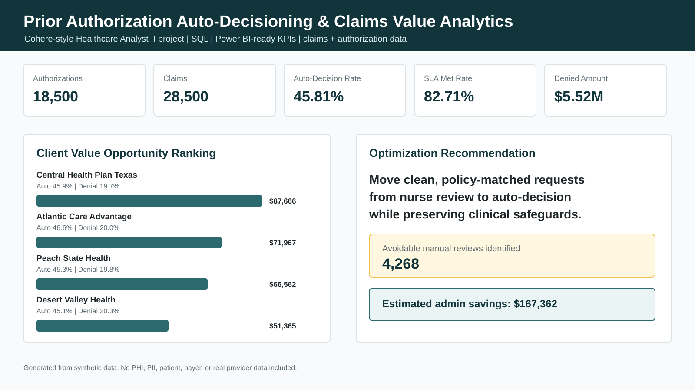

# Prior Authorization Auto-Decisioning & Claims Value Analytics

Healthcare analytics project built for Cohere Health's Healthcare Analyst II role.



## Six-Second Recruiter Signal

Built a Cohere-style analytics package using SQL, Python, Power BI-ready exports, KPI definitions, and stakeholder documentation to analyze prior authorization auto-decisioning, claims outcomes, cost/utilization trends, clinical rule performance, and client value opportunities.

**Role alignment:** Healthcare Analyst II, SQL, Power BI/Tableau, claims and authorization data, auto-decisioning strategy, operational performance, cost/utilization analysis, clinical outcomes, client reporting, KPI tracking, rule refinement.

## Project Highlights

- Analyzed 18,500 synthetic prior authorization requests and 28,500 linked claims.
- Measured auto-decision rate, decision SLA performance, denial rate, denied amount, and client value opportunity.
- Identified 4,268 avoidable manual reviews that could be candidates for rule refinement.
- Built SQL queries for monthly client performance, claims outcomes, rule refinement, and KPI exception reporting.
- Created Power BI/Tableau-ready exports, KPI dictionary, data dictionary, dashboard specification, stakeholder summary, and executive findings.
- Generated a dashboard preview designed for recruiter and stakeholder review.

## Business Problem

Healthcare payer clients need prior authorization programs that are fast, clinically appropriate, measurable, and easy to explain to internal and external stakeholders. Auto-decisioning can reduce manual review burden and improve turnaround time, but only if analytics teams continuously monitor performance, claims outcomes, client value, and clinical rule behavior.

This project simulates how a Healthcare Analyst II would support a Cohere-style analytics team: build detailed datasets, analyze authorization and claims outcomes, identify optimization opportunities, prepare client-facing reporting, and recommend clinical rule refinements.

## Questions Answered

- Which clients and service categories have the strongest auto-decisioning performance?
- Where are clean, policy-matched requests still going to manual review?
- How do authorization paths relate to downstream claims denial patterns?
- Which clinical decision rules should be tuned, monitored, retired, or supported with better documentation prompts?
- What KPIs should client delivery and internal stakeholders track each month?

## Dataset Overview

All data is synthetic and safe for public GitHub. No PHI, PII, patient data, member data, payer data, or real provider data is included.

| Dataset | Rows | Purpose |
|---|---:|---|
| `authorization_requests.csv` | 18,500 | Prior authorization requests, decision source, clinical policy match, documentation, decision time, request cost |
| `claims.csv` | 28,500 | Linked claims outcomes, denial reasons, allowed/paid/denied amounts |
| `providers.csv` | 720 | Provider specialty, state, network status, credentialing status, risk tier |
| `clients.csv` | 4 | Synthetic payer clients, line of business, implementation wave, SLA targets |
| `clinical_decision_rules.csv` | 30 | Rule performance metadata and refinement recommendations |

## Technical Work

### Python

- Generates synthetic healthcare authorization, claims, provider, client, and clinical rule datasets.
- Scores auto-decision performance, SLA adherence, avoidable manual reviews, claims denial rate, denied amount, admin savings, and client value opportunity.
- Exports Power BI/Tableau-ready CSV files.
- Creates an executive dashboard preview image.
- Writes an executive findings report.

### SQL

The SQL workbook includes:

- Client monthly performance scorecard
- Rule refinement opportunity analysis
- Claims outcome analysis by decision path
- Client-facing KPI exception list

### BI and Reporting

Power BI-ready exports:

- `executive_scorecard.csv`
- `powerbi_client_monthly_performance.csv`
- `powerbi_rule_refinement_tracker.csv`

Dashboard documentation:

- Executive Performance
- Auto-Decision Optimization
- Claims and Cost Outcomes
- Client Reporting
- Clinical Rule Refinement

## KPIs

| KPI | Business Use |
|---|---|
| Auto-decision rate | Measures automation performance |
| Decision SLA met rate | Tracks turnaround and operational performance |
| Avoidable manual reviews | Identifies rule-refinement opportunity |
| Average decision hours | Measures authorization speed |
| Claims denial rate | Links authorization to downstream outcomes |
| Denied amount | Quantifies payment and revenue exposure |
| Estimated admin savings | Shows client and operational value |
| Client value opportunity | Prioritizes client optimization roadmap |
| Policy match rate | Guides clinical rule tuning |
| Documentation complete rate | Identifies provider/client education needs |

## Executive Findings

After running the project pipeline:

- Authorization volume analyzed: generated in `reports/executive_findings.md`
- Claims volume analyzed: generated in `reports/executive_findings.md`
- Auto-decision rate, SLA performance, denial rate, admin savings, and client opportunity are exported in `data/exports/executive_scorecard.csv`

The core recommendation is to move clean, policy-matched, documentation-complete requests from manual review into the auto-decision path while preserving clinical and compliance safeguards.

## Dashboard Preview

Dashboard preview:

```text
dashboards/screenshots/executive_dashboard_preview.svg
```

## Repository Structure

```text
data/
  raw/              Synthetic source files
  processed/        Scored authorization and claims detail
  exports/          Power BI/Tableau-ready KPI outputs
sql/                SQL analytics workbook
src/                Python data generation and analytics pipeline
docs/               KPI dictionary, data dictionary, dashboard spec, stakeholder summary
reports/            Executive findings and scorecards
tests/              Output contract tests
```

## How to Run

```bash
pip install -r requirements.txt
python src/build_outputs.py
python -m pytest
```

## Resume Bullet

Built a Cohere-style healthcare analytics project using SQL, Python, Power BI-ready exports, KPI definitions, and stakeholder documentation to analyze prior authorization auto-decisioning, claims outcomes, cost/utilization trends, clinical rule performance, and client value opportunities across 18,500 synthetic authorizations and 28,500 linked claims.

## Interview Talking Points

- How I identified avoidable manual reviews for auto-decision optimization.
- How claims denial outcomes can validate or challenge authorization strategy.
- How I would communicate KPI performance to client delivery and internal stakeholders.
- How clinical rule refinement can improve automation while preserving safeguards.
- How Power BI-ready exports support self-service reporting and client analytics.
